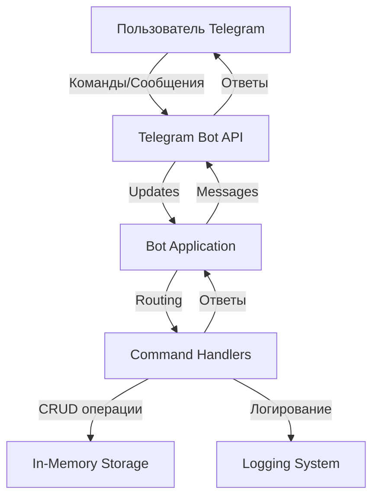
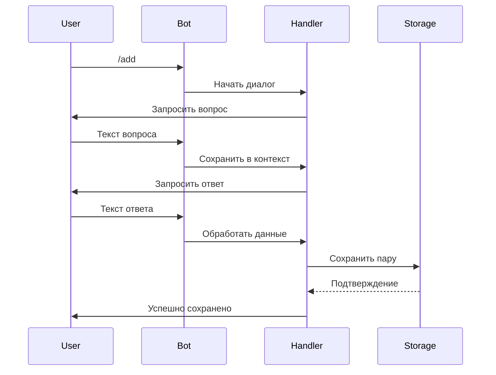
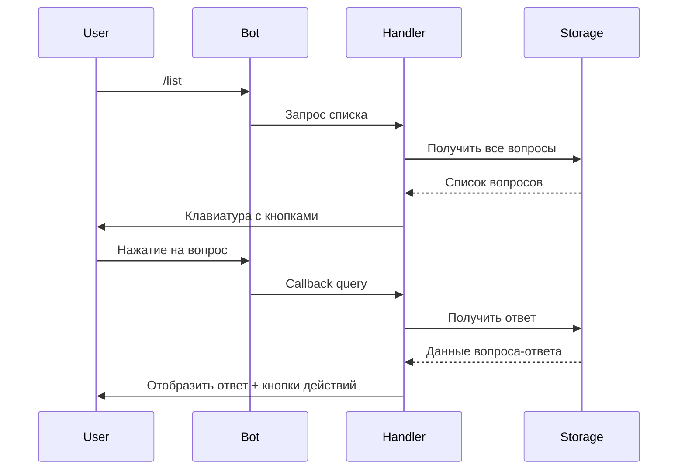
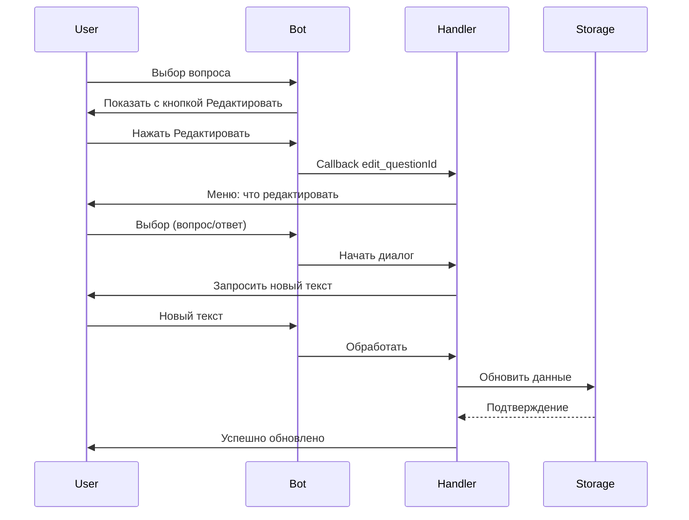
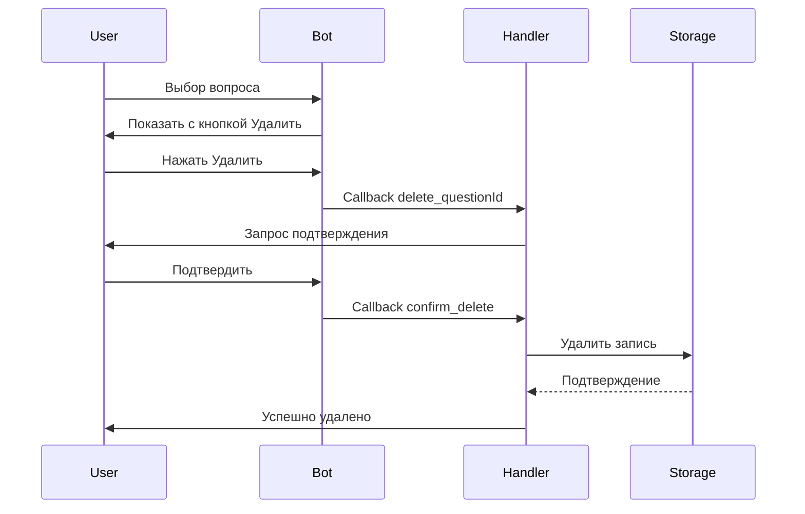

# Архитектура Telegram бота для хранения вопросов-ответов

## 1. Обзор проекта

### 1.1 Цель
Создание Telegram бота на Python для хранения и управления парами вопрос-ответ с общей базой данных для всех пользователей.

### 1.2 Ключевые требования
- Хранение до 100 пар вопрос-ответ в памяти
- Общая база данных для всех пользователей
- Функции: добавление, просмотр, редактирование, удаление
- Интерактивный интерфейс с кнопками
- Простота развертывания и использования

### 1.3 Технологический стек
- **Язык**: Python 3.8+
- **Библиотека**: python-telegram-bot 20.7
- **Хранилище**: In-memory (словарь Python)
- **Логирование**: встроенный модуль logging

---

## 2. Системная архитектура

### 2.1 Компонентная диаграмма



### 2.2 Архитектурные слои

#### Слой взаимодействия (Interaction Layer)
- Обработка входящих обновлений от Telegram API
- Маршрутизация команд к соответствующим обработчикам
- Формирование и отправка ответов пользователю

#### Слой бизнес-логики (Business Logic Layer)
- Обработчики команд (CommandHandler)
- Обработчики диалогов (ConversationHandler)
- Обработчики callback-кнопок (CallbackQueryHandler)
- Валидация данных

#### Слой данных (Data Layer)
- In-memory хранилище (словарь Python)
- CRUD операции над вопросами-ответами
- Управление состоянием диалогов

---

## 3. Структура данных

### 3.1 Модель хранения

```python
# Основное хранилище
qa_storage = {
    "question_id_1": {
        "question": "Текст вопроса",
        "answer": "Текст ответа",
        "created_at": "2024-01-01T12:00:00",
        "created_by": "user_id",
        "updated_at": "2024-01-01T12:00:00"
    }
}

# Временное хранилище состояний пользователей
user_context = {
    "user_id": {
        "state": "WAITING_ANSWER",
        "temp_data": {...}
    }
}
```

### 3.2 Структура идентификаторов

- **Question ID**: UUID или автоинкрементный счетчик
- **User ID**: Telegram user_id
- **Callback Data**: формат `action_questionId` (например, `edit_123`, `delete_456`)

---

## 4. Поток данных и взаимодействия

### 4.1 Добавление вопроса



### 4.2 Просмотр и выбор вопроса



### 4.3 Редактирование вопроса



### 4.4 Удаление вопроса



---

## 5. Команды и обработчики

### 5.1 Список команд

| Команда | Описание | Обработчик |
|---------|----------|------------|
| `/start` | Приветствие и справка | CommandHandler |
| `/help` | Подробная справка | CommandHandler |
| `/add` | Добавить вопрос-ответ | ConversationHandler |
| `/list` | Показать все вопросы | CommandHandler + CallbackQueryHandler |
| `/search` | Поиск по вопросам | ConversationHandler |
| `/cancel` | Отменить текущую операцию | CommandHandler |

### 5.2 Состояния ConversationHandler

```python
# Состояния для добавления
WAITING_QUESTION = 0
WAITING_ANSWER = 1

# Состояния для редактирования
EDIT_CHOICE = 2
EDIT_QUESTION = 3
EDIT_ANSWER = 4

# Состояния для удаления
CONFIRM_DELETE = 5
```

### 5.3 Callback Data формат

```python
# Просмотр вопроса
"view_<question_id>"

# Редактирование
"edit_<question_id>"
"edit_q_<question_id>"  # редактировать вопрос
"edit_a_<question_id>"  # редактировать ответ

# Удаление
"delete_<question_id>"
"confirm_delete_<question_id>"
"cancel_delete_<question_id>"

# Навигация
"back_to_list"
"back_to_question_<question_id>"
```

---

## 6. Интерфейс пользователя

### 6.1 Структура клавиатур

#### Главное меню (после /list)
```
┌─────────────────────────────┐
│ 1. Как установить Python?   │
├─────────────────────────────┤
│ 2. Что такое API?           │
├─────────────────────────────┤
│ 3. Как работает Git?        │
└─────────────────────────────┘
```

#### Просмотр вопроса
```
❓ Вопрос: Как установить Python?
💡 Ответ: Скачайте с python.org...

┌──────────────┬──────────────┐
│ ✏️ Редактировать │ 🗑️ Удалить   │
├──────────────┴──────────────┤
│      ⬅️ К списку            │
└─────────────────────────────┘
```

#### Меню редактирования
```
Что вы хотите изменить?

┌─────────────────────────────┐
│    📝 Изменить вопрос        │
├─────────────────────────────┤
│    💬 Изменить ответ         │
├─────────────────────────────┤
│    ❌ Отмена                 │
└─────────────────────────────┘
```

#### Подтверждение удаления
```
⚠️ Вы уверены, что хотите удалить этот вопрос?

Вопрос: Как установить Python?

┌──────────────┬──────────────┐
│ ✅ Да, удалить │ ❌ Отмена     │
└──────────────┴──────────────┘
```

---

## 7. Обработка ошибок

### 7.1 Типы ошибок

| Ошибка | Причина | Обработка |
|--------|---------|-----------|
| NetworkError | Проблемы с Telegram API | Retry с экспоненциальной задержкой |
| InvalidInput | Некорректный ввод пользователя | Сообщение с инструкцией |
| QuestionNotFound | Вопрос не найден | Сообщение об ошибке + возврат к списку |
| StorageError | Ошибка при работе с хранилищем | Логирование + сообщение пользователю |
| CallbackError | Некорректный callback_data | Логирование + игнорирование |

### 7.2 Стратегия обработки

```python
try:
    # Основная логика
    result = perform_operation()
except SpecificError as e:
    logger.error(f"Error: {e}")
    await send_user_friendly_message()
except Exception as e:
    logger.critical(f"Unexpected error: {e}")
    await send_generic_error_message()
finally:
    # Очистка ресурсов
    cleanup()
```

---

## 8. Логирование

### 8.1 Уровни логирования

- **DEBUG**: Детальная информация для отладки
- **INFO**: Общие информационные сообщения (команды, действия)
- **WARNING**: Предупреждения (некорректный ввод, deprecated функции)
- **ERROR**: Ошибки, не прерывающие работу
- **CRITICAL**: Критические ошибки, требующие вмешательства

### 8.2 Формат логов

```python
logging.basicConfig(
    format='%(asctime)s - %(name)s - %(levelname)s - %(message)s',
    level=logging.INFO,
    handlers=[
        logging.FileHandler('bot.log'),
        logging.StreamHandler()
    ]
)
```

### 8.3 Что логировать

- Запуск/остановка бота
- Все команды пользователей
- CRUD операции с данными
- Ошибки и исключения
- Статистика использования

---

## 9. Безопасность

### 9.1 Меры безопасности

1. **Токен бота**: Хранить в переменных окружения или отдельном конфиге
2. **Валидация ввода**: Проверка длины и содержимого текста
3. **Rate limiting**: Ограничение частоты запросов (встроено в библиотеку)
4. **Санитизация данных**: Экранирование специальных символов

### 9.2 Ограничения

```python
MAX_QUESTION_LENGTH = 500
MAX_ANSWER_LENGTH = 2000
MAX_QUESTIONS_TOTAL = 100
MAX_QUESTIONS_PER_USER_PER_DAY = 20
```

---

## 10. Масштабируемость и производительность

### 10.1 Текущие ограничения

- In-memory хранилище: данные теряются при перезапуске
- Один процесс: нет горизонтального масштабирования
- Синхронная обработка: может быть узким местом при большой нагрузке

### 10.2 Пути улучшения (для будущих версий)

1. **Персистентное хранилище**
   - SQLite для простых случаев
   - PostgreSQL для продакшена
   - Redis для кэширования

2. **Асинхронность**
   - Использование async/await для всех операций
   - Параллельная обработка запросов

3. **Кэширование**
   - Кэш списка вопросов
   - Кэш часто запрашиваемых ответов

4. **Мониторинг**
   - Метрики использования
   - Алерты при ошибках
   - Дашборды производительности

---

## 11. План реализации

### 11.1 Фаза 1: Базовый функционал
- Настройка проекта и зависимостей
- Реализация команд `/start`, `/help`
- Реализация добавления вопросов (`/add`)
- Реализация просмотра списка (`/list`)
- Базовое логирование

### 11.2 Фаза 2: Расширенный функционал
- Реализация редактирования вопросов
- Реализация удаления вопросов
- Улучшенный UI с inline-кнопками
- Подтверждения для критических действий

### 11.3 Фаза 3: Полировка
- Обработка всех edge cases
- Улучшенная обработка ошибок
- Документация и README
- Тестирование всех сценариев

### 11.4 Фаза 4: Опциональные улучшения
- Экспорт/импорт данных
- Статистика использования

### 11.5 Фаза 5: Семантический поиск (Реализовано)
- Интеграция sentence-transformers для AI-поиска
- Генерация эмбеддингов для вопросов
- Реализация команды `/search`
- Ранжирование результатов по релевантности
- Миграция существующих вопросов
- Поиск по вопросам
- Категории вопросов

---

## 12. Структура проекта

```
tg_bot/
├── bot.py                 # Основной файл бота
├── config.py              # Конфигурация (токен, настройки)
│   └── sqlite.py          # SQLite хранилище с эмбеддингами
├── handlers/              # Обработчики команд
│   ├── __init__.py
│   ├── basic.py          # /start, /help
│   ├── add.py            # Добавление вопросов
│   ├── semantic_search.py # Семантический поиск
│   ├── list.py           # Просмотр списка
│   ├── edit.py           # Редактирование
│   └── delete.py         # Удаление
├── storage/               # Работа с данными
│   ├── __init__.py
│   └── memory.py         # In-memory хранилище
│   ├── search.py          # Семантический поиск
├── utils/                 # Вспомогательные функции
│   ├── __init__.py
├── migrate_embeddings.py  # Скрипт миграции эмбеддингов
├── SEMANTIC_SEARCH_README.md  # Документация по поиску
├── SEMANTIC_SEARCH_PLAN.md    # План реализации поиска
├── SEMANTIC_SEARCH_SPEC.md    # Техническая спецификация
├── SEMANTIC_SEARCH_DIAGRAM.md # Диаграммы архитектуры
│   ├── validators.py     # Валидация данных
│   └── keyboards.py      # Генерация клавиатур
├── requirements.txt       # Зависимости
├── README.md             # Документация пользователя
├── ARCHITECTURE.md       # Этот документ
└── .env.example          # Пример конфигурации
```

---

## 13. Тестирование

### 13.1 Типы тестов

1. **Unit тесты**
   - Тестирование функций валидации
   - Тестирование CRUD операций
   - Тестирование генерации клавиатур

2. **Integration тесты**
   - Тестирование обработчиков команд
   - Тестирование диалогов
   - Тестирование callback handlers

3. **E2E тесты**
   - Полные пользовательские сценарии
   - Тестирование через Telegram Bot API

### 13.2 Тестовые сценарии

- Добавление вопроса с корректными данными
- Добавление вопроса с некорректными данными
- Просмотр пустого списка
- Просмотр списка с вопросами
- Редактирование существующего вопроса
- Редактирование несуществующего вопроса
- Удаление с подтверждением
- Удаление с отменой
- Отмена операции в середине диалога

---

## 14. Развертывание

### 14.1 Локальное развертывание

```bash
# Клонирование репозитория
git clone <repo_url>
cd tg_bot

# Создание виртуального окружения
python -m venv venv
source venv/bin/activate  # Linux/Mac
# или
venv\Scripts\activate  # Windows

# Установка зависимостей
pip install -r requirements.txt

# Настройка токена
cp .env.example .env
# Отредактировать .env и добавить токен

# Запуск
python bot.py
```

### 14.2 Продакшн развертывание

**Опции:**
1. VPS (DigitalOcean, AWS EC2, etc.)
2. PaaS (Heroku, Railway, Render)
3. Контейнеризация (Docker)

**Рекомендации:**
- Использовать systemd для автозапуска
- Настроить логирование в файл
- Использовать reverse proxy (nginx)
- Настроить мониторинг

---

## 15. Мониторинг и поддержка

### 15.1 Метрики для отслеживания

- Количество активных пользователей
- Количество вопросов в базе
- Частота использования команд
- Время отклика бота
- Количество ошибок

### 15.2 Инструменты мониторинга

- Логи: tail -f bot.log
- Метрики: Prometheus + Grafana (для продакшена)
- Алерты: настроить уведомления при критических ошибках

---

## 16. Заключение

Данная архитектура обеспечивает:

---

## 17. Семантический поиск (Semantic Search)

### 17.1 Обзор

Бот оснащен AI-powered семантическим поиском, который позволяет находить релевантные вопросы по смыслу запроса, а не только по точному совпадению ключевых слов.

### 17.2 Технологии

- **Модель**: sentence-transformers/paraphrase-multilingual-MiniLM-L12-v2
- **Размер модели**: ~420MB
- **Размерность эмбеддингов**: 384
- **Языки**: Русский, Английский и 50+ других
- **Метод сравнения**: Косинусное сходство

### 17.3 Архитектура поиска


### 17.4 Хранение эмбеддингов

```sql
CREATE TABLE questions (
    id TEXT PRIMARY KEY,
    question TEXT NOT NULL,
    answer TEXT NOT NULL,
    created_at TEXT NOT NULL,
    created_by INTEGER NOT NULL,
    updated_at TEXT NOT NULL,
    embedding BLOB  -- 384 float32 = 1536 bytes
)
```

### 17.5 Процесс поиска

1. **Генерация эмбеддинга запроса** (~50-100ms)
2. **Загрузка эмбеддингов вопросов** из БД
3. **Вычисление косинусного сходства** (~1-5ms для 100 вопросов)
4. **Ранжирование по релевантности** (0-100%)
5. **Фильтрация по порогу** (по умолчанию 30%)
6. **Возврат топ-K результатов** (по умолчанию 5)

### 17.6 Конфигурация

```python
# config.py
SEMANTIC_SEARCH_ENABLED = True
SEMANTIC_SEARCH_MODEL = "sentence-transformers/paraphrase-multilingual-MiniLM-L12-v2"
SEARCH_TOP_K = 5
SEARCH_SIMILARITY_THRESHOLD = 0.3
SEARCH_BATCH_SIZE = 10
MAX_QUERY_LENGTH = 200
MODEL_CACHE_DIR = "./models"
```

### 17.7 Производительность

| Метрика | Значение |
|---------|----------|
| Загрузка модели (первый раз) | 2-5 секунд |
| Загрузка модели (кэш) | < 0.5 секунд |
| Генерация эмбеддинга | 50-100ms |
| Поиск (100 вопросов) | 100-200ms |
| Использование RAM | ~500MB |
| Использование диска | ~670MB |

### 17.8 Примеры использования

**Запрос**: "как установить python"

**Результаты**:
- 95% - "Как установить Python?"
- 78% - "Установка Python на Windows"
- 65% - "Настройка окружения Python"

### 17.9 Автоматическая генерация эмбеддингов

- При добавлении нового вопроса (`/add`)
- При редактировании текста вопроса (`/edit`)
- При миграции существующих вопросов (`migrate_embeddings.py`)

### 17.10 Команда /search

```
User: /search
Bot: 🔍 Введите поисковый запрос:

User: как установить python
Bot: 📊 Найдено 3 результата:

1. ⭐ 95% - Как установить Python?
   💡 Скачайте с python.org...
   [Показать полностью]

2. ⭐ 78% - Установка Python на Windows
   💡 Для Windows скачайте...
   [Показать полностью]

3. ⭐ 65% - Настройка окружения Python
   💡 После установки...
   [Показать полностью]

[Новый поиск] [К списку]
```

### 17.11 Преимущества

✅ **Понимание смысла**: Находит вопросы по смыслу, а не только по словам
✅ **Мультиязычность**: Работает на русском и английском
✅ **Устойчивость к опечаткам**: Частично обрабатывает опечатки
✅ **Офлайн работа**: После загрузки модели не требует интернета
✅ **Быстрый поиск**: Результаты за < 500ms
✅ **Автоматизация**: Эмбеддинги генерируются автоматически

### 17.12 Ограничения

- Требует ~500MB RAM для модели
- Первая загрузка модели занимает 2-5 секунд
- Требует ~670MB дискового пространства
- Не идеален для очень коротких запросов (< 3 слов)

### 17.13 Миграция

Для генерации эмбеддингов для существующих вопросов:

```bash
python migrate_embeddings.py
```

Скрипт:
- Загружает модель
- Обрабатывает вопросы батчами
- Сохраняет эмбеддинги в БД
- Показывает прогресс

### 17.14 Отключение поиска

Если нужно отключить семантический поиск:

```bash
# .env
SEMANTIC_SEARCH_ENABLED=false
```

Бот продолжит работать без функции поиска.

### 17.15 Документация

Подробная документация:
- **SEMANTIC_SEARCH_README.md** - Руководство пользователя
- **SEMANTIC_SEARCH_PLAN.md** - План реализации
- **SEMANTIC_SEARCH_SPEC.md** - Техническая спецификация
- **SEMANTIC_SEARCH_DIAGRAM.md** - Диаграммы архитектуры

---

## 18. Обновленное заключение

Данная архитектура обеспечивает:
- ✅ Простоту реализации и поддержки
- ✅ Расширяемость для будущих улучшений
- ✅ Хорошую структуру кода
- ✅ Понятный пользовательский интерфейс
- ✅ Надежную обработку ошибок
- ✅ **AI-powered семантический поиск**
- ✅ **Персистентное хранилище (SQLite)**
- ✅ **Автоматическую индексацию вопросов**

Архитектура спроектирована с учетом текущих требований и предоставляет четкий путь для масштабирования в будущем. Добавление семантического поиска значительно улучшает пользовательский опыт, позволяя находить информацию быстрее и эффективнее.
- ✅ Простоту реализации и поддержки
- ✅ Расширяемость для будущих улучшений
- ✅ Хорошую структуру кода
- ✅ Понятный пользовательский интерфейс
- ✅ Надежную обработку ошибок

Архитектура спроектирована с учетом текущих требований (до 100 вопросов, in-memory хранилище) и предоставляет четкий путь для масштабирования в будущем.
