# Semantic Search Architecture Diagrams

## 1. System Architecture

```mermaid
graph TB
    User[👤 User] -->|/search| Bot[🤖 Telegram Bot]
    Bot -->|Query| SearchHandler[Search Handler]
    SearchHandler -->|Text| SearchEngine[Semantic Search Engine]
    SearchEngine -->|Embedding| Model[Sentence Transformer Model]
    Model -->|Vector 384d| SearchEngine
    SearchEngine -->|Compare| Storage[(SQLite Database)]
    Storage -->|Questions + Embeddings| SearchEngine
    SearchEngine -->|Ranked Results| SearchHandler
    SearchHandler -->|Formatted Response| Bot
    Bot -->|Results| User

    style Model fill:#e1f5ff
    style SearchEngine fill:#fff4e1
    style Storage fill:#e8f5e9
    style SearchHandler fill:#fce4ec
```

## 2. Data Flow

```mermaid
sequenceDiagram
    participant U as User
    participant B as Bot
    participant H as Search Handler
    participant E as Search Engine
    participant M as Model
    participant D as Database

    U->>B: /search
    B->>H: Start search conversation
    H->>U: Request query
    U->>B: "как установить python"
    B->>H: Process query
    H->>E: search(query)
    E->>M: encode(query)
    M-->>E: query_embedding [384d]
    E->>D: get_all_questions_with_embeddings()
    D-->>E: questions + embeddings
    E->>E: compute_similarity()
    E->>E: rank_by_score()
    E->>E: filter_by_threshold()
    E-->>H: top_k results with scores
    H->>H: format_results()
    H->>U: Display ranked results
```

## 3. Component Architecture

## 4. Embedding Storage

```mermaid
graph TB
    subgraph "Question Record"
        ID[id: UUID]
        Q[question: TEXT]
        A[answer: TEXT]
        E[embedding: BLOB]
        Meta[metadata...]
    end

    subgraph "Embedding Format"
        NP[NumPy Array]
        F32[384 × float32]
        Bytes[1,536 bytes]
    end

    Q -->|encode| NP
    NP -->|serialize| F32
    F32 -->|tobytes| Bytes
    Bytes --> E

    style Q fill:#e1f5ff
    style E fill:#fff4e1
    style NP fill:#e8f5e9
```

## 5. Search Process

## 6. Model Loading Strategy

## 7. Database Schema Evolution

## 8. Similarity Computation

## 9. Error Handling Flow

## 10. Performance Optimization

## 11. User Experience Flow

## 12. Deployment Pipeline

---

## Legend

- 🤖 Bot Components
- 💾 Storage/Database
- 🧠 ML/AI Components
- 👤 User Interactions
- ⚙️ Processing Steps
- 📊 Data Flow
- ✅ Success States
- ❌ Error States

## Notes

All diagrams use Mermaid syntax and can be rendered in:
- GitHub
- GitLab
- VS Code (with Mermaid extension)
- Documentation sites
- Markdown viewers

These diagrams provide visual representation of:
1. Overall system architecture
2. Data flow between components
3. Search process step-by-step
4. Database schema changes
5. Error handling strategies
6. Performance optimization
7. User experience journey
8. Deployment process
