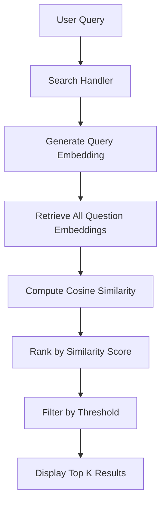

# Semantic Search Implementation Plan

## Overview
Adding semantic search functionality to the Telegram Q&A bot using sentence-transformers library with embeddings-based similarity search.

## Architecture Decisions

### 1. Model Selection
**Recommended Model**: `sentence-transformers/paraphrase-multilingual-MiniLM-L12-v2`

**Rationale**:
- Multilingual support (includes Russian)
- Compact size (~420MB)
- Good balance between quality and performance
- 384-dimensional embeddings
- Optimized for semantic similarity tasks

**Alternative Models**:
- `sentence-transformers/LaBSE` - Better quality but larger (~470MB)
- `cointegrated/rubert-tiny2` - Smaller, Russian-specific (~120MB)

### 2. Storage Strategy

#### Database Schema Extension
```sql
ALTER TABLE questions ADD COLUMN embedding BLOB;
CREATE INDEX idx_questions_embedding ON questions(id);
```

**Embedding Storage Format**:
- Store as BLOB (Binary Large Object)
- Serialize numpy array using `numpy.tobytes()`
- Deserialize using `numpy.frombuffer()`
- Each embedding: 384 floats × 4 bytes = 1,536 bytes

#### Migration Strategy
1. Add new column to existing table
2. Generate embeddings for all existing questions
3. Store embeddings in new column
4. Create index for faster retrieval

### 3. Search Architecture



### 4. Component Design

#### A. Semantic Search Module (`utils/semantic_search.py`)

**Responsibilities**:
- Load and cache sentence-transformer model
- Generate embeddings for text
- Compute cosine similarity between embeddings
- Rank results by similarity score

**Key Classes**:
```python
class SemanticSearchEngine:
    - __init__(model_name: str)
    - encode(text: str) -> np.ndarray
    - search(query: str, candidates: List[Dict]) -> List[Dict]
    - compute_similarity(query_emb: np.ndarray, doc_embs: np.ndarray) -> np.ndarray
```

#### B. Storage Extension (`storage/sqlite.py`)

**New Methods**:
- `add_question()` - Modified to generate and store embedding
- `update_question()` - Modified to regenerate embedding if question changes
- `get_all_questions_with_embeddings()` - Retrieve questions with embeddings
- `migrate_embeddings()` - Generate embeddings for existing questions

**Schema Changes**:
```python
CREATE TABLE questions (
    id TEXT PRIMARY KEY,
    question TEXT NOT NULL,
    answer TEXT NOT NULL,
    created_at TEXT NOT NULL,
    created_by INTEGER NOT NULL,
    updated_at TEXT NOT NULL,
    embedding BLOB  -- NEW COLUMN
)
```

#### C. Search Handler (`handlers/search.py`)

**Flow**:
1. User sends `/search` command
2. Bot asks for search query
3. User provides query text
4. System generates query embedding
5. System computes similarity with all questions
6. System ranks and filters results
7. Bot displays top results with scores

**States**:
```python
WAITING_SEARCH_QUERY = 0
```

### 5. Configuration

**New Config Parameters** (`config.py`):
```python
# Semantic Search Configuration
SEMANTIC_SEARCH_MODEL = "sentence-transformers/paraphrase-multilingual-MiniLM-L12-v2"
SEARCH_TOP_K = 5  # Number of top results to return
SEARCH_SIMILARITY_THRESHOLD = 0.3  # Minimum similarity score (0-1)
SEARCH_CACHE_MODEL = True  # Cache model in memory
```

### 6. User Interface

#### Search Command Flow
```
User: /search
Bot: 🔍 Введите поисковый запрос:

User: как установить python
Bot: 📊 Найдено 3 результата:

1. ⭐ 95% - Как установить Python?
   💡 Скачайте с python.org...
   [Показать полностью]

2. ⭐ 78% - Установка Python на Windows
   💡 Для Windows скачайте...
   [Показать полностью]

3. ⭐ 65% - Настройка окружения Python
   💡 После установки...
   [Показать полностью]

[Новый поиск] [К списку]
```

### 7. Performance Considerations

#### Model Loading
- **First Load**: ~2-3 seconds (download + initialization)
- **Cached Load**: ~0.5 seconds (from disk)
- **Memory Usage**: ~500MB RAM

#### Search Performance
- **Embedding Generation**: ~50-100ms per query
- **Similarity Computation**: ~1-5ms for 100 questions
- **Total Search Time**: ~100-200ms

#### Optimization Strategies
1. **Singleton Pattern**: Load model once, reuse across requests
2. **Lazy Loading**: Load model only when first search is performed
3. **Batch Processing**: Generate embeddings in batches during migration
4. **Caching**: Cache frequently searched queries (optional future enhancement)

### 8. Error Handling

**Potential Errors**:
1. Model download failure (network issues)
2. Insufficient disk space for model
3. Memory errors during embedding generation
4. Database migration failures

**Handling Strategy**:
```python
try:
    model = load_model()
except Exception as e:
    logger.error(f"Failed to load model: {e}")
    # Fallback to simple text search or inform user
    await update.message.reply_text(
        "❌ Семантический поиск временно недоступен.\n"
        "Используйте /list для просмотра всех вопросов."
    )
```

### 9. Testing Strategy

#### Unit Tests
- Test embedding generation
- Test similarity computation
- Test ranking algorithm
- Test threshold filtering

#### Integration Tests
- Test search handler flow
- Test database migration
- Test embedding storage/retrieval

#### Manual Testing Scenarios
1. Search with exact question match
2. Search with paraphrased question
3. Search with partial keywords
4. Search with typos
5. Search in Russian and English
6. Search with no results
7. Search with many results

### 10. Migration Plan

#### Step 1: Add Dependencies
```bash
pip install sentence-transformers numpy
```

#### Step 2: Database Migration
```python
# Run migration script
python -m scripts.migrate_embeddings
```

#### Step 3: Test Search
```bash
# Start bot and test /search command
python bot.py
```

#### Step 4: Monitor Performance
- Check model loading time
- Monitor memory usage
- Verify search accuracy

### 11. Future Enhancements

1. **Query Expansion**: Use synonyms and related terms
2. **Hybrid Search**: Combine semantic + keyword search
3. **Search History**: Track popular searches
4. **Personalization**: Learn from user interactions
5. **Multi-language**: Detect query language automatically
6. **Filters**: Search by date, author, category
7. **Fuzzy Matching**: Handle typos better
8. **Search Analytics**: Track search metrics

### 12. Dependencies

**New Requirements**:
```txt
sentence-transformers==2.2.2
torch>=2.0.0
numpy>=1.24.0
```

**Total Additional Size**:
- sentence-transformers: ~50MB
- torch: ~200MB (CPU version)
- Model: ~420MB
- **Total**: ~670MB

### 13. Rollback Plan

If semantic search causes issues:
1. Remove `/search` command from bot
2. Keep embedding column but don't use it
3. Revert to `/list` for browsing questions
4. No data loss - embeddings are additive

### 14. Documentation Updates

**Files to Update**:
1. `README.md` - Add /search command documentation
2. `ARCHITECTURE.md` - Add semantic search section
3. `requirements.txt` - Add new dependencies
4. `handlers/basic.py` - Update /help text

### 15. Success Metrics

**Quantitative**:
- Search response time < 500ms
- Model loading time < 5s
- Memory usage < 1GB
- Search accuracy > 80% for paraphrased queries

**Qualitative**:
- Users find relevant questions easily
- Search handles Russian text well
- Results are ranked appropriately
- No performance degradation

## Implementation Checklist

- [ ] Research and select model
- [ ] Add dependencies to requirements.txt
- [ ] Create semantic_search.py module
- [ ] Extend SQLite schema
- [ ] Implement migration script
- [ ] Update add_question method
- [ ] Update update_question method
- [ ] Create search handler
- [ ] Register search command
- [ ] Update help text
- [ ] Add search results UI
- [ ] Implement model caching
- [ ] Add configuration options
- [ ] Test with Russian queries
- [ ] Update documentation

## Timeline Estimate

- **Setup & Dependencies**: 30 minutes
- **Core Implementation**: 2-3 hours
- **Testing & Debugging**: 1-2 hours
- **Documentation**: 30 minutes
- **Total**: 4-6 hours

## Conclusion

This implementation provides a robust, scalable semantic search solution that:
- Works offline after initial model download
- Handles Russian text effectively
- Provides fast, accurate results
- Integrates seamlessly with existing architecture
- Allows for future enhancements
